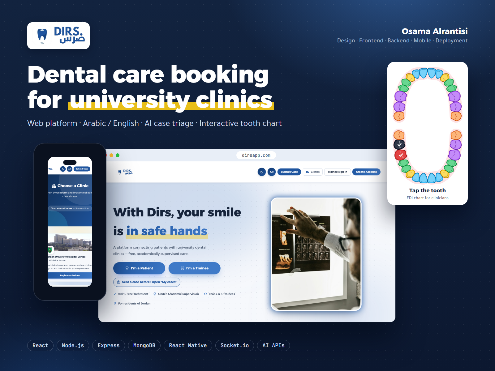
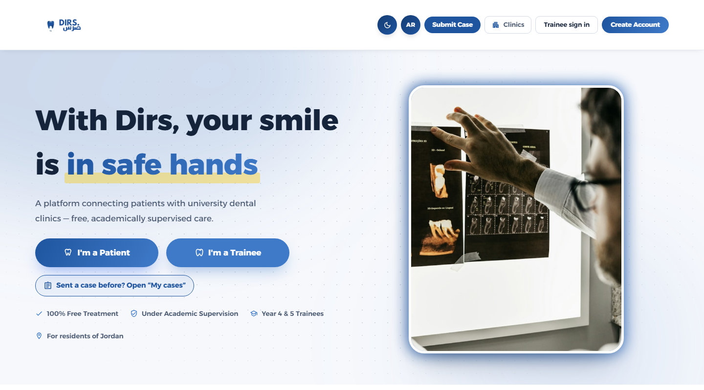
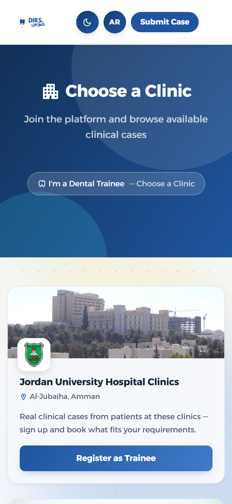
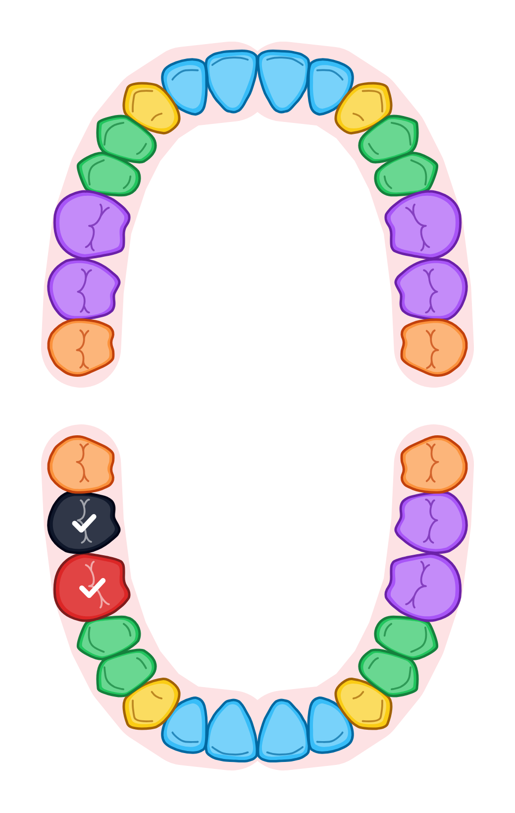
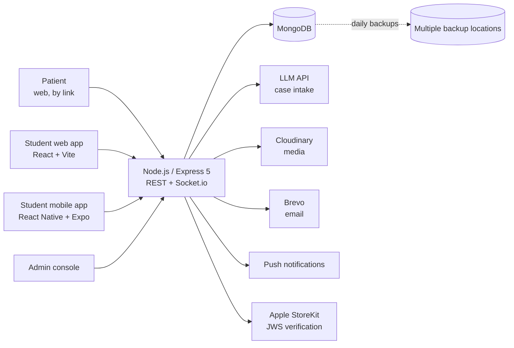

# Dirs — ضرس

**A healthtech platform connecting dental students with patients who need treatment at university clinics.**

Dental students need real patients to complete their clinical requirements. Patients need supervised care and often don't know university clinics offer it. Dirs connects the two, and routes every case to the right student, at the right clinic, at the right time.

🌐 **Live:** [dirsapp.com](https://dirsapp.com) · 🏥 Clinic booking opens with the first semester (October 2026) · 📱 Student app (React Native): store release in progress

> Co-founded and built end to end by a single developer: backend, web app, mobile app, admin console and operations.
> Source code is private. Happy to walk through the architecture and design decisions in an interview.

---

## Screenshots

| Landing page | Clinics (phone) | Tooth chart |
|---|---|---|
|  |  |  |

Tooth outlines adapted from [react-odontogram](https://github.com/biomathcode/react-odontogram) (MIT).

---

## How it works

**Patients** don't create an account. They open a link, pick a clinic, go through a short emergency check, answer a few questions, tap the tooth that hurts on a tooth chart, and can add a photo or an X-ray. They follow their case with a tracking link and a 6-digit code, from any device.

**Students** sign in, see the cases their academic year and clinical requirements allow, book one against the clinic's schedule, and confirm the treatment in the clinic with the patient's code.

**University admins** manage their own clinic: cases, students, schedules, groups and the treatments the clinic offers. They talk to students through in-app chat.

---

## Architecture

Hosted on **Render** with auto-deploy from Git.

---

## Key engineering decisions

### 1. AI assists, rules decide
A language model asks the patient short, adaptive multiple-choice questions and returns JSON validated against a schema. **The model never makes the routing decision.** Routing follows a deterministic, per-university clinical triage protocol. The AI layer has timeouts, fallbacks and cooldowns, so intake keeps working when the model is slow or unavailable.

*Why:* clinical routing has to be predictable, explainable and auditable. A language model is good at asking the next sensible question and bad at being accountable.

### 2. No patient accounts, without weakening security
Patients submit a case through a link and track it with a link and a 6-digit code. Tracking tokens are stored only as hashes, codes are checked with HMAC behind per-IP and per-phone rate limits, and in-clinic confirmation locks after five wrong attempts. The same code is how a student confirms the treatment in the clinic, so a case only counts when the patient was actually there.

*Why:* every extra screen loses patients, and most of them use the platform once or twice. Removing the account had to come with another way to prove "this is my case".

### 3. Matching and booking with real constraints
Cases are routed to eligible students by academic year and clinical requirement. Bookings are validated against clinic schedules and subgroups, with per-requirement quotas calculated from live case data. Treatments a clinic doesn't offer are hidden from the patient before they choose.

*Why:* students need specific case types to graduate, and clinics have fixed schedules. A booking that ignores either one wastes a patient visit.

### 4. Multi-tenant isolation
Each university has its own scoped admins and permissions. Patients and students are tied to the university clinic where treatment takes place, and data never crosses that boundary.

*Why:* universities are separate institutions. The pre-launch audit proved how easy this is to get wrong: some of the authorization gaps it found were exactly this boundary leaking, in the urgent-case flow and in admin statistics.

### 5. Closing a race condition in urgent cases
Two requests could pick the same "available now" student at the same moment. Both read "available" and both succeeded, so one student got two urgent cases.

The fix makes the check and the write **one atomic step**: `findOneAndUpdate({ _id, isAvailableNow: true }, { isAvailableNow: false })`. The first request claims the student; the second no longer matches the condition and gets a `409 Conflict`. A concurrency test went from two successes to one success and one 409.

### 6. Payments verified on the server
Student subscriptions support Apple In-App Purchase (StoreKit), verified server-side by validating the **JWS certificate chain**, never by trusting the client. It is built and switches on once the App Store setup is complete.

*Why:* an Apple transaction is a signed token. Just decoding it without checking that the certificate chain ends at Apple's root would let anyone forge a lifetime subscription.

### 7. Built to survive production
- Automated **daily database backups** to multiple locations, with a **tested restore script**
- Auto-deploy from Git on Render
- Feature flags and environment switches, so new behaviour can be turned off without a deploy
- SEO: per-route meta tags, a dynamic sitemap, crawler-visible page content, structured data (JSON-LD) and IndexNow

---

## Features

- **Smart case intake**: emergency check first, adaptive questions, tooth chart, optional photo or X-ray
- **Tooth chart**: anatomical teeth the patient taps; students see the same chart from the dentist's side with FDI numbers; the set of teeth follows the patient's age (primary, mixed or permanent)
- **Case tracking**: "My cases" on the device, a tracking link and a 6-digit code, and feedback after treatment
- **Real-time chat** between university admins and students (Socket.io): attachments, voice notes, reactions, search, typing indicators, unread tracking; web and mobile
- **Multi-tenant admin console**: cases, students, schedules, analytics, moderation and subscriptions per university
- **Arabic / English**: full internationalization with RTL, plus a server-side translation layer for API messages
- **Localized push notifications** in each device's language
- **Patient-management module** for students (records, appointments, clinics)
- Built and kept behind feature flags: a learning (LMS) module and a loyalty / referral system

---

## Security & privacy

- JWT with multi-device session management
- Per-route rate limiting and Content Security Policy
- Hashed tracking tokens, HMAC-verified 6-digit codes and lockouts
- Guardian consent for patients under 18
- OTP-verified account deletion (soft delete)
- Phone numbers normalized to E.164
- Students without a subscription only see anonymized case previews
- A retention job that deletes case photos 30 days after treatment (running in report-only mode until it is switched on)

**Pre-launch QA and security audit: 17 findings, 15 fixed, 2 kept by design.** The audit was AI-assisted; I directed it, reviewed every finding and decided what to fix. Fixed findings include:
- 4 authorization gaps: cross-university data isolation, resource-ownership checks, and WebSocket participant/presence checks
- A high-severity Linux deployment blocker
- A race condition in urgent-case assignment

Every fix is covered by regression tests (Jest + Supertest on the server, Vitest on the web client).

The two by-design findings are low risk: registration says whether an email or phone is already used (a usability trade-off, mitigated by rate limiting), and users can see a few internal fields of **their own** profile.

---

## Tech stack

| Layer | Technologies |
|---|---|
| Backend | Node.js, Express 5, Socket.io, JWT |
| Database | MongoDB, Mongoose |
| Web | React, Vite, Redux Toolkit |
| Mobile | React Native, Expo, EAS Build & OTA updates |
| AI | LLM API with schema-validated output |
| Payments | Apple StoreKit |
| Infra | Render, Git, automated backups |
| Services | Cloudinary, Brevo |
| Testing | Jest, Supertest, Vitest |

---

## Author

**Osama Alrantisi** — Co-Founder & Full-Stack Developer, Amman, Jordan
[LinkedIn](https://www.linkedin.com/in/osama-alrantisi-a605b5241) · osama1492003@gmail.com
