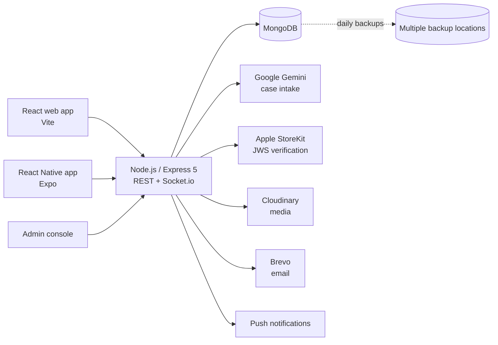

# Dirs — ضرس

**A healthtech platform connecting dental students with patients who need treatment at university clinics.**

Dental students need real patients to complete their clinical requirements. Patients need affordable, supervised care. Dirs connects the two — and routes every case to the right student, at the right clinic, at the right time.

🌐 **Live:** [dirsapp.com](https://dirsapp.com) · 📱 iOS app submitted to the App Store · 🤖 Android in progress · 👥 218 registered users

> Designed, built and deployed end to end by a single developer: backend, web app, mobile app, admin console and operations.
> Source code is private. Happy to walk through the architecture and design decisions in an interview.

---

<!-- Screenshots: uncomment once screenshots/intake.png, dashboard.png and chat.png are added
## Screenshots

| Patient intake | Student dashboard | Chat |
|---|---|---|
|  |  |  |

---
-->

## Architecture

Hosted on **Render** with auto-deploy from Git.

---

## Key engineering decisions

### 1. AI extracts, rules decide
Patients describe their problem in free text. Google Gemini turns it into a structured case — but **the model never makes the routing decision**. Routing follows a deterministic, per-university clinical triage protocol. The AI layer has fallbacks, timeouts and cooldowns, so intake keeps working when the model is slow or unavailable.

*Why:* clinical routing has to be predictable, explainable and auditable. A language model is great at reading messy text and bad at being accountable.

### 2. Matching and booking with real constraints
Cases are routed to eligible students by academic year and clinical requirement. Bookings are validated against clinic schedules and subgroups, with per-requirement quotas calculated from live case data.

### 3. Multi-tenant isolation
Each university has its own scoped admins and permissions. Patients and trainees are tied to the university clinic where treatment takes place, and data never crosses that boundary.

### 4. Payments verified on the server
Subscriptions use Apple In-App Purchase (StoreKit). Transactions are verified server-side by validating the **JWS certificate chain**, never by trusting the client.

### 5. Built to survive production
- Automated **daily database backups** to multiple locations, with a **tested restore script**
- Auto-deploy from Git on Render
- Per-route meta tags and a dynamic sitemap for SEO

---

## Features

- **Real-time chat** (Socket.io) — attachments, voice notes, reactions, search, typing indicators, unread tracking; web and mobile
- **Multi-tenant admin console** — analytics, moderation, plans and case types per university
- **Arabic / English** — full internationalization with RTL, plus a server-side translation layer for API messages
- **Localized push notifications** in each device's language
- **Patient-management module** for students (records, appointments, clinics) with Free and Pro tiers
- **Learning (LMS)** and **loyalty / referral** systems

---

## Security & compliance

- JWT with multi-device session management
- Per-route rate limiting and Content Security Policy
- Guardian consent for patients under 18
- OTP-verified account deletion (soft delete)
- Phone numbers normalized to E.164

**Pre-launch QA and security audit: 17 findings, 15 fixed**, including:
- 4 authorization gaps — cross-university data isolation, resource-ownership checks, and WebSocket participant/presence checks
- A high-severity Linux deployment blocker
- A race condition in urgent-case assignment

Every fix is covered by regression tests.

---

## Tech stack

| Layer | Technologies |
|---|---|
| Backend | Node.js, Express 5, Socket.io, JWT |
| Database | MongoDB, Mongoose |
| Web | React, Vite |
| Mobile | React Native, Expo, EAS Build & OTA updates |
| AI | Google Gemini API |
| Payments | Apple StoreKit |
| Infra | Render, Git, automated backups |
| Services | Cloudinary, Brevo |

---

## Author

**Osama Alrantisi** — Full-Stack Developer, Amman, Jordan
[LinkedIn](https://www.linkedin.com/in/osama-alrantisi-a605b5241) · osama1492003@gmail.com
