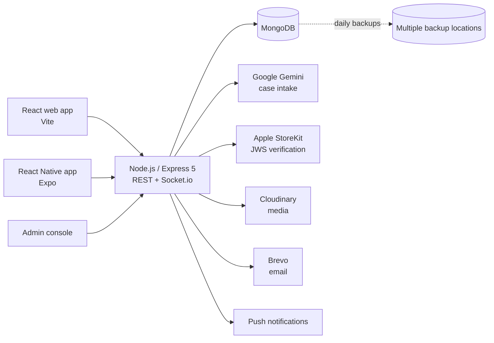

# Dirs — ضرس

**A healthtech platform connecting dental students with patients who need treatment at university clinics.**

Dental students need real patients to complete their clinical requirements. Patients need affordable, supervised care. Dirs connects the two — and routes every case to the right student, at the right clinic, at the right time.

🌐 **Live:** [dirsapp.com](https://dirsapp.com) · 📱 iOS app submitted to the App Store · 🤖 Android in progress · 👥 218 registered users

> Co-founded and built end to end by a single developer: backend, web app, mobile app, admin console and operations.
> Source code is private. Happy to walk through the architecture and design decisions in an interview.

---

<!-- Screenshots: uncomment once screenshots/intake.png, dashboard.png and chat.png are added
## Screenshots

| Patient intake | Student dashboard | Chat |
|---|---|---|
|  |  |  |

---
-->

## Architecture

Hosted on **Render** with auto-deploy from Git.

---

## Key engineering decisions

### 1. AI extracts, rules decide
Patients describe their problem in free text. Google Gemini turns it into a structured case — but **the model never makes the routing decision**. Routing follows a deterministic, per-university clinical triage protocol. The AI layer has fallbacks, timeouts and cooldowns, so intake keeps working when the model is slow or unavailable.

*Why:* clinical routing has to be predictable, explainable and auditable. A language model is great at reading messy text and bad at being accountable.

### 2. Matching and booking with real constraints
Cases are routed to eligible students by academic year and clinical requirement. Bookings are validated against clinic schedules and subgroups, with per-requirement quotas calculated from live case data.

*Why:* students need specific case types to graduate, and clinics have fixed schedules. A booking that ignores either one wastes a patient visit.

### 3. Multi-tenant isolation
Each university has its own scoped admins and permissions. Patients and trainees are tied to the university clinic where treatment takes place, and data never crosses that boundary.

*Why:* universities are separate institutions. The pre-launch audit proved how easy this is to get wrong: some of the authorization gaps it found were exactly this boundary leaking, in the urgent-case flow and in admin statistics.

### 4. Payments verified on the server
Subscriptions use Apple In-App Purchase (StoreKit). Transactions are verified server-side by validating the **JWS certificate chain**, never by trusting the client.

*Why:* an Apple transaction is a signed token. Just decoding it without checking that the certificate chain ends at Apple's root would let anyone forge a lifetime subscription.

### 5. Closing a race condition in urgent cases
A patient with an urgent case picks a student who is "available now". If two patients picked the same student at the same moment, both requests read "available" and both succeeded, so one student got two urgent cases.

The fix makes the check and the write **one atomic step**: `findOneAndUpdate({ _id, isAvailableNow: true }, { isAvailableNow: false })`. The first request claims the student; the second no longer matches the condition and gets a `409 Conflict`. A concurrency test went from two successes to one success and one 409.

### 6. Built to survive production
- Automated **daily database backups** to multiple locations, with a **tested restore script**
- Auto-deploy from Git on Render
- Per-route meta tags and a dynamic sitemap for SEO

---

## Features

- **Real-time chat** (Socket.io) — attachments, voice notes, reactions, search, typing indicators, unread tracking; web and mobile
- **Multi-tenant admin console** — analytics, moderation, plans and case types per university
- **Arabic / English** — full internationalization with RTL, plus a server-side translation layer for API messages
- **Localized push notifications** in each device's language
- **Patient-management module** for students (records, appointments, clinics) with Free and Pro tiers
- **Learning (LMS)** and **loyalty / referral** systems

---

## Security & compliance

- JWT with multi-device session management
- Per-route rate limiting and Content Security Policy
- Guardian consent for patients under 18
- OTP-verified account deletion (soft delete)
- Phone numbers normalized to E.164

**Pre-launch QA and security audit: 17 findings, 15 fixed, 2 kept by design.** The audit was AI-assisted; I directed it, reviewed every finding and decided what to fix. Fixed findings include:
- 4 authorization gaps — cross-university data isolation, resource-ownership checks, and WebSocket participant/presence checks
- A high-severity Linux deployment blocker
- A race condition in urgent-case assignment

Every fix is covered by regression tests (Jest + Supertest).

The two by-design findings are low risk: registration says whether an email or phone is already used (a usability trade-off, mitigated by rate limiting), and users can see a few internal fields of **their own** profile.

---

## Tech stack

| Layer | Technologies |
|---|---|
| Backend | Node.js, Express 5, Socket.io, JWT |
| Database | MongoDB, Mongoose |
| Web | React, Vite |
| Mobile | React Native, Expo, EAS Build & OTA updates |
| AI | Google Gemini API |
| Payments | Apple StoreKit |
| Infra | Render, Git, automated backups |
| Services | Cloudinary, Brevo |

---

## Author

**Osama Alrantisi** — Co-Founder & Full-Stack Developer, Amman, Jordan
[LinkedIn](https://www.linkedin.com/in/osama-alrantisi-a605b5241) · osama1492003@gmail.com
